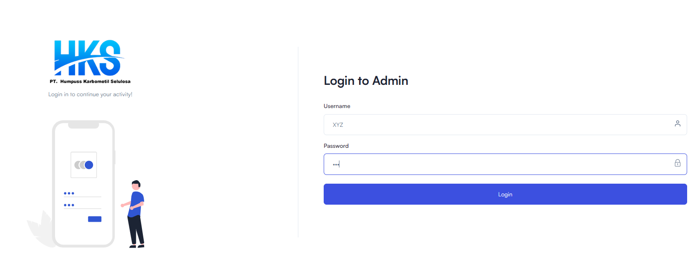
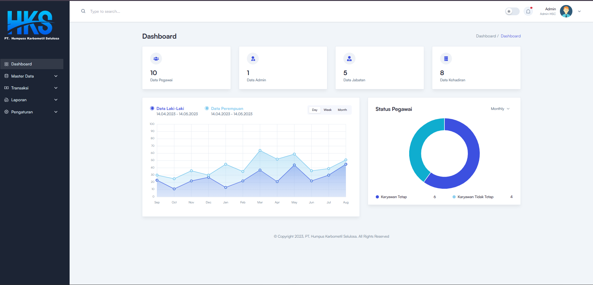
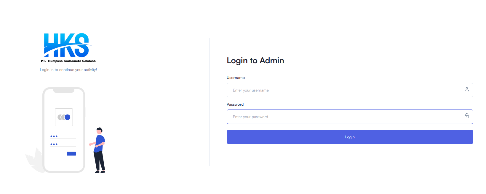
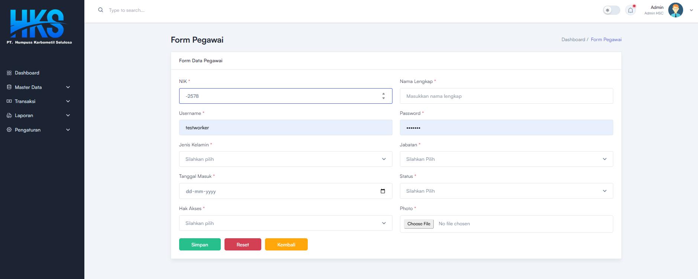
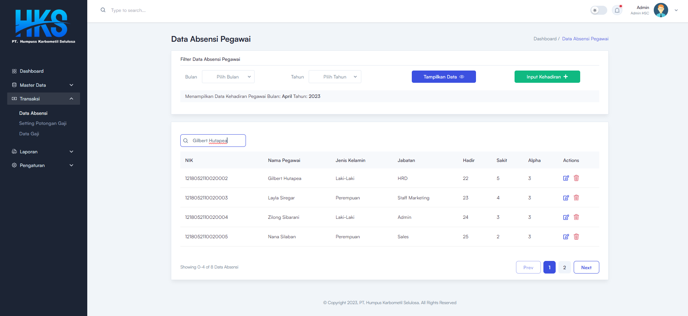
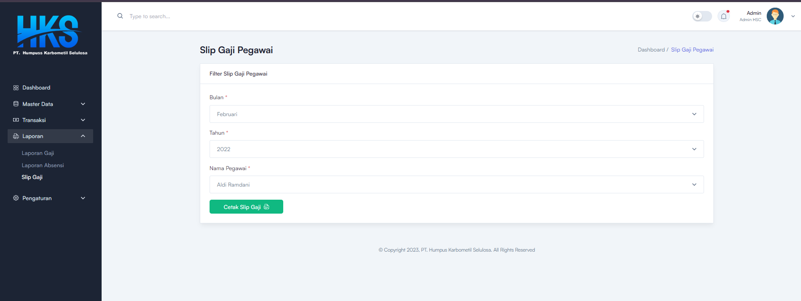
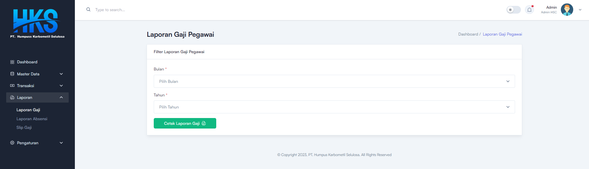
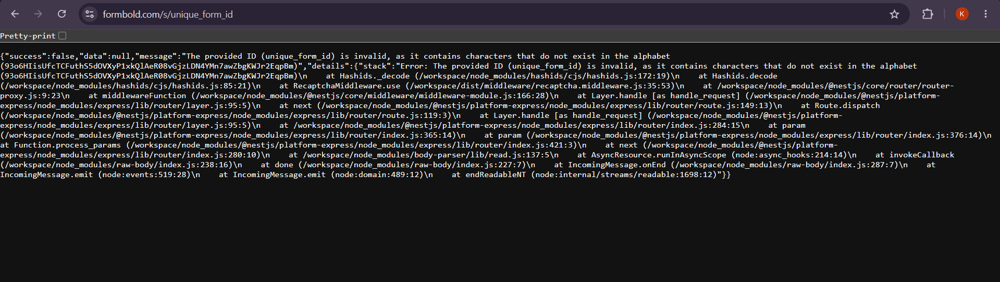

# Negative Testing Report

## Project: HRMS - Employee Salary Management

**Written by:** Krithika Devadiga
**Date:** June 26, 2026
**Repo:** github.com/KrithikaDevadiga444/mern-employee-salary-management

---

## Purpose

Along with testing the normal user flow, I also tried giving the application unexpected or invalid inputs to see how it handled them.

The goal was to check whether the system could prevent incorrect actions, show proper error messages, and protect important employee and payroll data.

---

## Test 1 - Login with Random Credentials

**What I tried:**

* Random username: `xyz123`
* Random password: `wrongpassword`

**Expected Result:**
The application should reject the login and display an "Invalid username or password" message.

**Actual Result:**
The application logged me into the admin dashboard.

**Observation:**
This exposed a critical authentication issue. The login page accepts any username and password because it isn't connected to backend authentication.

### Evidence

**Before Login**

**After Login**

---

## Test 2 - Login with Empty Username and Password

**What I tried:**

* Left both username and password blank.
* Clicked Login.

**Expected Result:**
The application should ask the user to enter both fields.

**Actual Result:**
The page still allowed navigation instead of validating the inputs.

**Observation:**
Basic input validation is missing before login.

**Evidence:**

---

## Test 3 - Add Employee with Invalid Data

**What I tried:**
I attempted to add a new employee and checked how the form behaved while entering data.

**Expected Result:**
The form should validate the input and save the employee only after all required information is provided correctly.

**Actual Result:**
Clicking Save redirected me back to the login page without saving anything.

**Observation:**
Since the form never reached the backend, I couldn't properly verify field validation because the save functionality itself was broken.

**Evidence:**

---

## Test 4 - Search Using Invalid Input

**What I tried:**
I searched using employee names, employee IDs, and random text that didn't exist.

**Expected Result:**
The employee list should either filter matching records or show "No results found."

**Actual Result:**
The employee list never changed regardless of the search value.

**Observation:**
The search box accepts input but doesn't perform any filtering.

**Evidence:**

---

## Test 5 - Generate Payslip Without a Working Backend Action

**What I tried:**
I selected the month, year, and employee, then clicked the "Cetak Slip Gaji" button.

**Expected Result:**
The application should generate or download the employee's payslip.

**Actual Result:**
Nothing happened. No PDF appeared and no network request was sent.

**Observation:**
The button looks functional but isn't connected to any backend process.

**Evidence:**

---

## Test 6 - Global Search Bar Exposes Internal Server Error

**What I tried:**

I typed an employee name (for example, "Gilbert") into the global search bar at the top of the dashboard and pressed **Enter**.

**Expected Result:**

The application should display matching search results or show a user-friendly message such as **"No results found."** It should not expose internal system information.

**Actual Result:**

Instead of performing a search, the application redirected to a page displaying a raw JSON error containing backend implementation details, including stack traces, middleware names, and internal error messages.

**Observation:**

The global search feature appears to be incomplete or incorrectly configured. Instead of handling the request gracefully, the application exposes raw backend error details, including stack traces and middleware information, which should never be visible to end users.

**Evidence:**

**Search Attempt**

**Raw Server Error Displayed**

---

## Overall Findings

Most of the issues I discovered followed a common pattern: the frontend UI appears complete, but several actions are either disconnected from the backend or missing proper validation and error handling.

Instead of processing requests safely, some features simply redirect to another page, do nothing, or expose raw server errors. Negative testing helped uncover these problems because they were not obvious during normal user flows.

These findings show why testing invalid inputs and unexpected user actions is important for protecting payroll data and improving the reliability of the HRMS.
